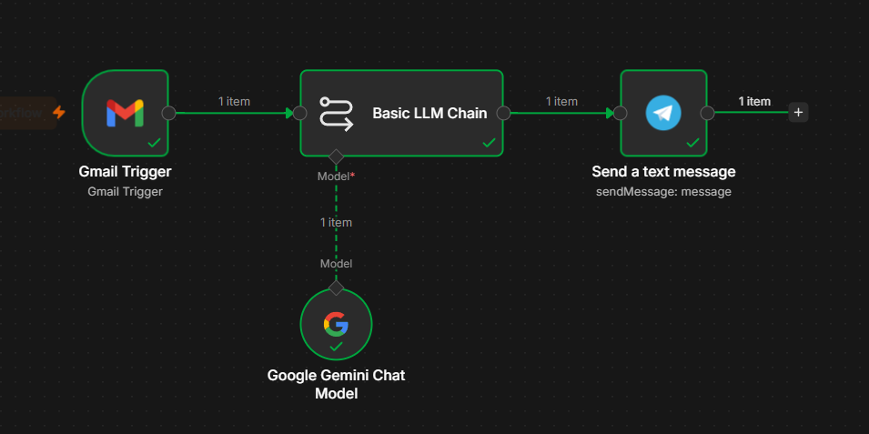
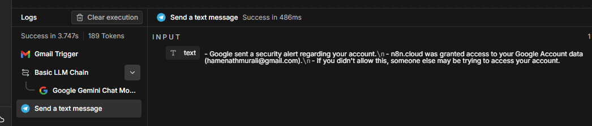
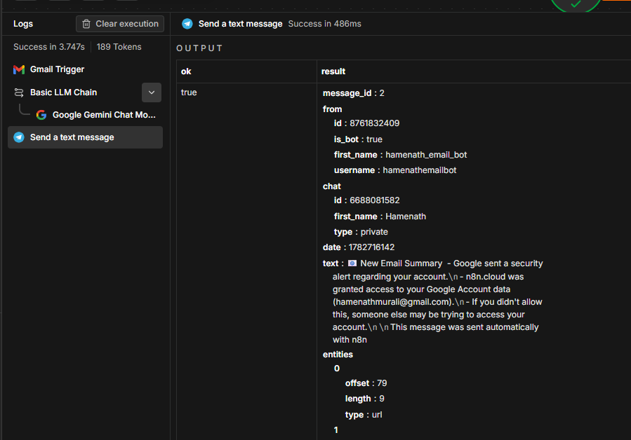

# 📧 AI Email Summarizer using n8n

An AI-powered workflow built with n8n that automatically summarizes incoming Gmail messages using Google Gemini AI and sends the summary directly to Telegram.

---

## 🚀 Features

- 📩 Detects new Gmail messages automatically
- 🤖 Summarizes emails using Google Gemini AI
- 📱 Sends AI summaries directly to Telegram
- ⚡ Fully automated workflow
- 🔄 Real-time email monitoring

---

## 🛠️ Tech Stack

- n8n
- Gmail Trigger
- Google Gemini 2.5 Flash
- Telegram Bot API
- Google OAuth

---

## 📂 Workflow

```text
Gmail Trigger
      │
      ▼
Basic LLM Chain
      │
      ▼
Google Gemini Chat Model
      │
      ▼
Telegram Send Message
```

---

# 📸 Screenshots

## Workflow



---

## Gmail Trigger



---

## Successful Execution



---

## ⚙️ Setup

### 1. Clone the repository

```bash
git clone https://github.com/Hamenath/ai-email-summarizer-n8n.git
```

### 2. Import the workflow

Open n8n and import the `workflow.json` file.

### 3. Configure Gmail OAuth

Connect your Gmail account using Google OAuth credentials.

### 4. Configure Gemini AI

Create a Google AI Studio API Key and connect the Gemini Chat Model.

### 5. Configure Telegram Bot

- Create a bot using **@BotFather**
- Copy the Bot Token
- Get your Chat ID
- Configure the Telegram node

### 6. Activate the workflow

Publish and activate the workflow.

---

## 📌 How It Works

1. A new email arrives in Gmail.
2. Gmail Trigger detects the email.
3. Gemini AI generates a concise summary.
4. The summary is sent automatically to Telegram.

---

## 📁 Repository Structure

```text
ai-email-summarizer-n8n
│
├── README.md
├── workflow.json
├── hero-workflow.png
├── gmail-trigger.png
├── execution-success.png
└── LICENSE
```

---

## 🎯 Example Output

```
📧 New Email Summary

• Google sent a security alert regarding your account.

• n8n.cloud was granted access to your Google Account.

• If you didn't authorize this action, someone else may be trying to access your account.
```

---

## 📜 License

This project is licensed under the MIT License.

---

## 👨‍💻 Author

**Hamenath B**

- GitHub: https://github.com/Hamenath
- Portfolio: https://hamenath.online

⭐ If you found this project useful, consider giving it a star!
